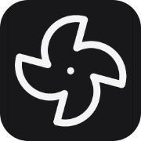

# StartKit

> A sane starting point for Next.js projects on the edge.

## Features

- **Edge-driven development.** 100% on the [edge](https://nextjs.org/docs/app/building-your-application/rendering/edge-and-nodejs-runtimes) by default.
- [Next.js 14](https://nextjs.org) with the `/app` directory and API Route Handlers.
- [Bun](https://bun.sh) as a package manager!
- [React Server Components](https://nextjs.org/docs/app/building-your-application/rendering/server-components) gallore
- [Typescript](https://www.typescriptlang.org/) for a rock-solid codebase
- [Drizzle](https://orm.drizzle.team) database ORM, configured for [PostgreSQL](https://www.postgresql.org/) and [Drizzle Kit](https://orm.drizzle.team/kit-docs/overview)
- Edge runtime ready.
- Strict, recommended [ESLint](https://eslint.org/) and [Prettier](https://prettier.io/) rules for readable, safe code.
- [TailwindCSS](https://tailwindcss.com/) for utility-first CSS.
- Gorgeous UI built with [Radix](https://www.radix-ui.com/) and [shadcn/ui](https://ui.shadcn.com/).
- Authentication via [Next Auth](https://next-auth.js.org/) version 5.
- Email via [Resend](https://resend.com) and [react email](https://react.email/).
- The beautiful [Inter](https://rsms.me/inter/) typeface.
- [Next Metadata API](https://beta.nextjs.org/docs/api-reference/metadata) for SEO handling, with file-system handlers.
- [Jest](https://jestjs.io/) testing, optimized for Next.js
- Dark Mode support (without bypassing Server Components).
- Sane VSCode settings and recommended extensions.

## Starting a new project with StartKit

1. Clone this repo to your desired path:

   ```sh
   git clone git@github.com:venables/startkit.git my-new-project
   ```

2. Initialize the project:

   ```sh
   ./bin/rename
   ```

   This will rename `startkit` to your project name throughout the app,
   update your git remote to be named `startkit`, install the `.env` file, and
   install all of your dependencies.

   In the future, you'll be able to pull in the latest StartKit changes without
   missing a beat by running:

   ```sh
   git fetch startkit
   git merge startkit/main
   ```

   Once you run `./bin/rename`, it will be safe to delete. You can also delete
   this section of the README.

## Getting Started

When you first check out a this project, you should run the following command to get your environment all set up:

```sh
bun run setup
```

## Environment variables

Environment variables are stored in `.env` files. By default the `.env` file is included in source control and contains
settings and defaults to get the app running. Any secrets or local overrides of these values should be placed in a
`.env.local` file, which is ignored from source control.

For environment-specific environment variables, you can place the defaults in `.env.development`, and overwrite locally
with `.env.development.local`.

You can [read more about environment variables here](https://nextjs.org/docs/basic-features/environment-variables).

## Running the server

```bash
bun run dev
```

The app will be running at [http://localhost:3000](http://localhost:3000).

## Edge by default 🚀

The guiding priciple of this app is that everything should run on the [edge](https://nextjs.org/docs/app/building-your-application/rendering/edge-and-nodejs-runtimes) by default. In some scenarios, we may need to run code in a `nodejs` runtime, but those are exceptions, not the rule.

All routes in the app are currently running on the `edge` runtime. This includes authentication routes which talk to our database, as well as our email-rendering logic. This has some limitations, as `react-email` [does not yet support edge](<(https://github.com/resendlabs/react-email/issues/871)>) and had to be patched (also, we can not use react-email's Tailwind component). The database also can not be run locally, as our edge adapter requires it to communicate via HTTP. We feel that these limitations are acceptable to allow for cleaner code, and to allow apps to run smoothly on the edge.

## Database

Drizzle is set up to use serverless PostgreSQL by default (via [Neon](https://neon.tech)), but any database will work. Simply set `DATABASE_URL` in your `.env` (or `.env.local`) file to work.

You should set `DATABASE_URL` and/or `DATABASE_URL_POOLED` to your [Neon](https://neon.tech) branch URL.

NOTE: The code is currently set up to connect to the database using Neon's serverless package. If you would like to run a local database, you can find instructions for connecting as if it were serverless [here](https://github.com/neondatabase/serverless/issues/33#issuecomment-1634853042).

### `bun run db`

This project exposes a package.json script for accessing drizzle-kit via `bun run db <command>`. This script handles all environment variable mapping automatically via `dotenv-cli`, so you don't have to think about it. You should always try to use this script when interacting with drizzle-kit locally.

### Making changes to the database schema

Make changes to your database by modifying `lib/db/schema.ts` ([learn more](https://orm.drizzle.team/docs/sql-schema-declaration)).

When prototyping changes, you can use [`db push`](https://orm.drizzle.team/kit-docs/overview):

```sh
bun run db push:pg
```

When you feel comfortable with the changes, you can make a migration file by running:

```sh
bun run db generate:pg
```

### Browsing the database

Drizzle offers a simple UI for inspecting the database. To launch it, run:

```sh
bun run db studio
```

## Email

Email is currently configured to send via [Resend](https://resend.com), and uses the wonderful [react-email](https://react.email) library.

Email templates live with your react code and are defined in [`./emails`](./emails).

To view live previews of your email templates, you can run:

```sh
bun run dev:email
```

And you will be able to visit [http://localhost:3001](http://localhost:3001) to edit your emails with live reload.

## UI components

By default, this project includes the following components from [shadcn/ui](https://ui.shadcn.com/):

- [Button](https://ui.shadcn.com/docs/components/button)
- [Toast](https://ui.shadcn.com/docs/components/toast)

To add new UI components from [shadcn/ui](https://ui.shadcn.com/), run:

```sh
pnpx shadcn-ui@latest add button
```

where `button` can be any UI element from the project.

## Linting / Checking the codebase

To run a full check of the codebase (type-check, lint, prettier check, test), run:

```sh
bun run check
```

### Linting

```sh
bun run lint
```

### Type Checking

```sh
bun run type-check
```

### Formatting with Prettier

```sh
bun run format
```

to check for format errors, run:

```sh
bun run format:check
```

### Testing via Jest

```sh
bun run test
```

## Patching Packages

Occasionally you need to patch a dependency. In general, you can use [patch-package](https://github.com/ds300/patch-package), but it does not yet have bun support ([See the open PR](https://github.com/ds300/patch-package/pull/490)). To patch a package, you should do he following:

1. Run `bun install --yarn` which will create a `yarn.lock` file (this will be temporary for us).
2. Modify the packages you need to patch within `node_modules`.
3. Run `bunx patch-package <package-name>`
4. Remove the `yarn.lock` file (`rm yarn.lock`)

Now your packages will be patched like normal.

## ❤️ Open Source

This project is MIT-licensed and is free to use and modify for your own projects.

It was created by [Matt Venables](https://venabl.es).
