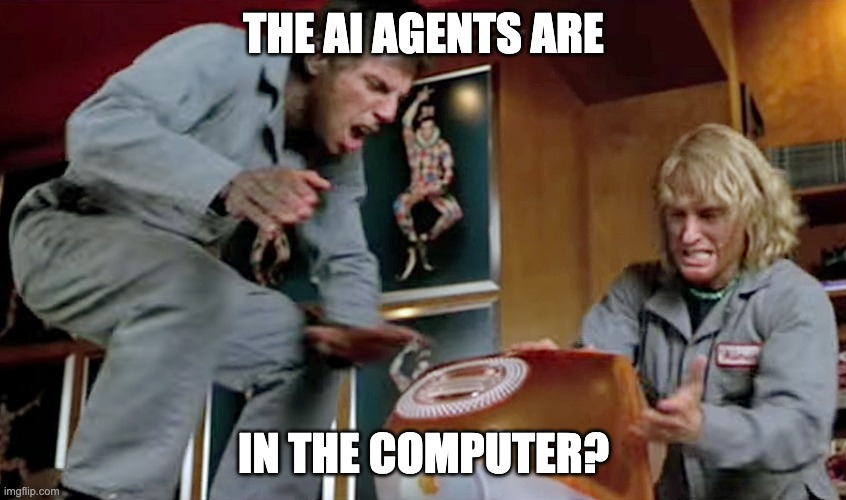

> NOTE: This post is primarily a reminder for myself for when I set up a new laptop.

I love vim (and neovim). But I also love the niceities of a modern editor, especially ones with AI agents built-in, like [Cursor](https://cursor.com).



But using Vim keybindings on MacOS and Cursor (or VSCode) needs a bit of teweaking. Specifically, you have to enable key-repeat so you can hold a key to move around.

Here's how to do it:

```sh
defaults write $(osascript -e 'id of app "Cursor"') ApplePressAndHoldEnabled -bool false
```
